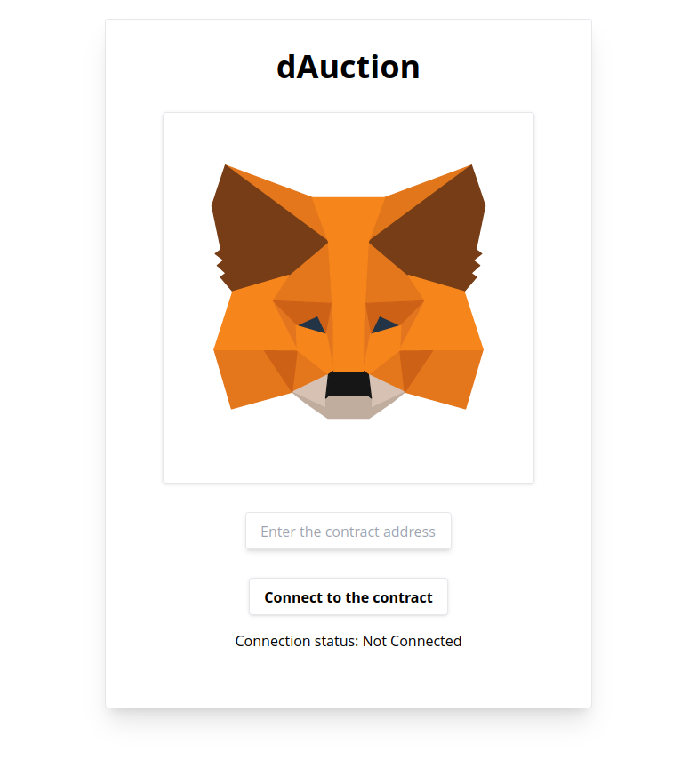
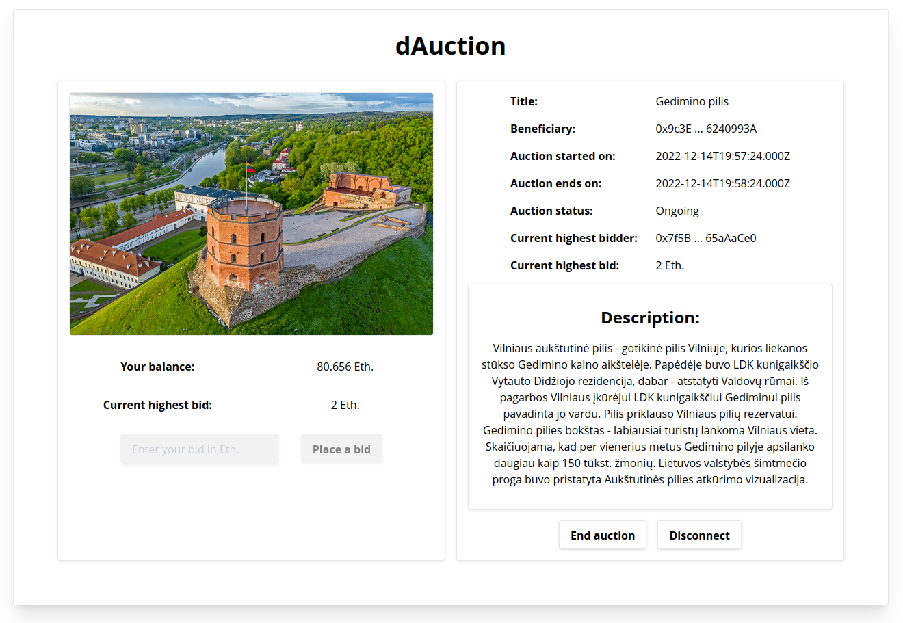
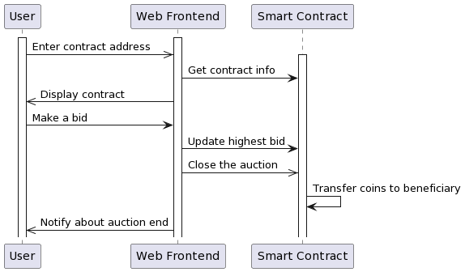

# dAuction

## Screenshots





# Tasks
- [x] Aprašykite išmaniosios sutarties verslo modelio logiką, kurią įgyvendins išmanioji sutartis.
- [x] Realizuokite pirmąjame žingsnyje aprašytą verslo logiką išmanioje sutartyje Solidyti kalboje.
- [x] Ištestuokite išmaniosios sutarties veikimą
  - [x] Ethereum lokaliame tinkle
  - [x] Ethereum testiniame tinkle (Goerli)
- [x] Naudojant Ethereum testinio tinklo Etherscan peržiūrėkite išmaniosios sutarties vykdymo "logus".
  - https://goerli.etherscan.io/address/0x2389CaBE728a4a8673B457B0CFB2FDf3B90C64c6 (better example)
  - https://goerli.etherscan.io/address/0x6347b6F82E4A127E2c9A84B05D31B9464923dFFF
- [x] Sukurkite decentralizuotos aplikacijos Front-End'ą

## Used libraries and tools
- Truffle
- Ganache
- Web3.js
- React
- Tailwind
- Vite

## Project setup

```bash
# install dependencies
yarn

# deploy on a local ganache network
truffle migrate --network development

# deploy on goerli testnet
# create .env file in root directory and fill in the secrets
truffle migrate --network goerli

# launch frontend
yarn dev

# and you are good to go
```

## dAuction UML model



